<Note>
  Cada dominio se representa en un diagrama ER independiente para facilitar la lectura. Los diagramas son **interactivos**: puedes hacer zoom y panear. Para el detalle de campos y restricciones de cada tabla, consulta [Arquitectura de BD](/arquitectura-bd).
</Note>

## Vista general de dominios

Cómo se relacionan los 9 dominios a alto nivel.

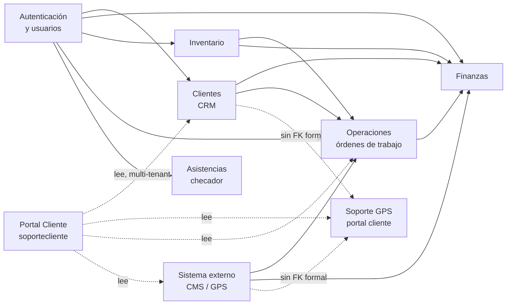

---

## Dominio 1 · Autenticación y usuarios

Modelo RBAC (usuarios, roles, permisos, aplicaciones), sesiones, tokens y estructura organizacional.

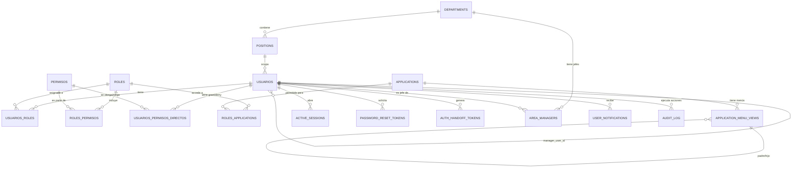

### Sub-dominio: Multi-compañía y productos

Tres tablas que permiten separar la operación por **compañía facturadora** (Soluciones, Ramsa) y **producto comercial** (B2B Tracking, Centraly). Cubre HU-59, HU-60 y HU-61.

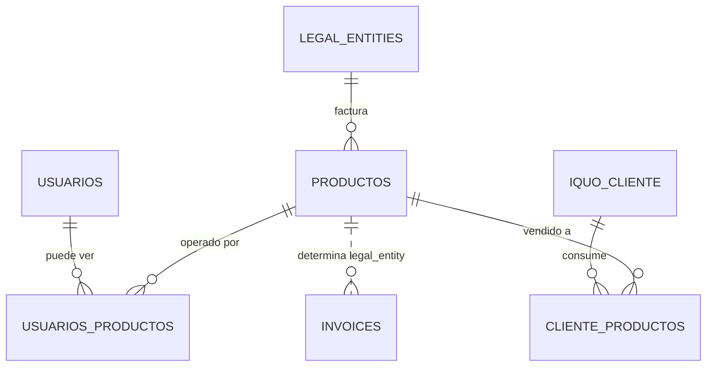

---

## Dominio 2 · Clientes (CRM)

Tabla maestra de clientes (heredada de Odoo) y sus satélites: cuentas de facturación, identificaciones fiscales, cuentas B2B, notas y contactos.

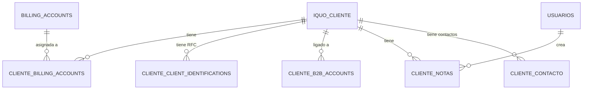

---

## Dominio 3 · Finanzas

Razones sociales, facturas (Alegra), ingresos, gastos, costos de instalación y pagos a técnicos.

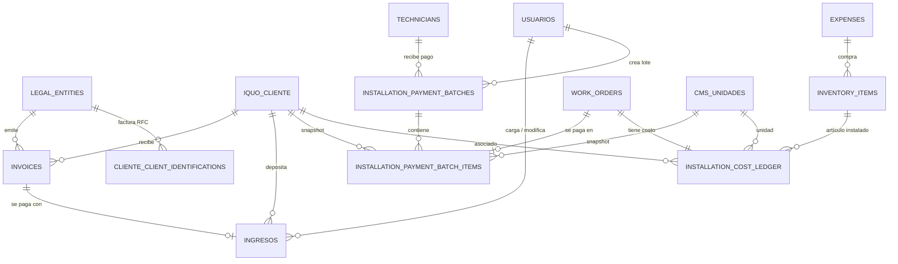

---

## Dominio 4 · Inventario

SIMs, técnicos, equipos GPS físicos y su historial de cambios.

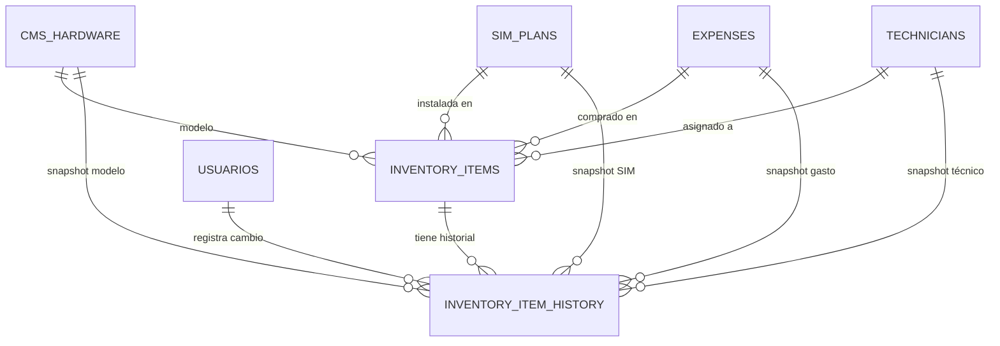

---

## Dominio 5 · Operaciones (órdenes de trabajo)

Órdenes de instalación/desinstalación, evidencias fotográficas y registros de check-in vía webhook.

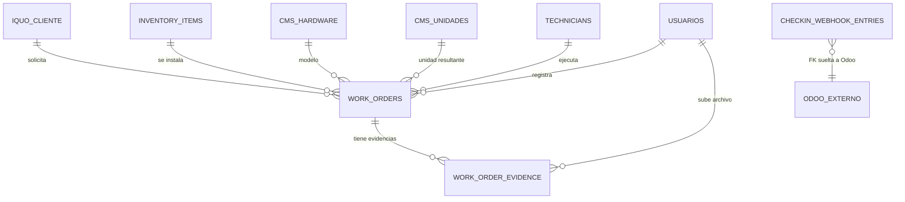

---

## Dominio 6 · Sistema externo CMS (flota GPS)

Tablas que reflejan datos del CMS externo: catálogo de hardware, unidades vehiculares y perfil del vehículo.

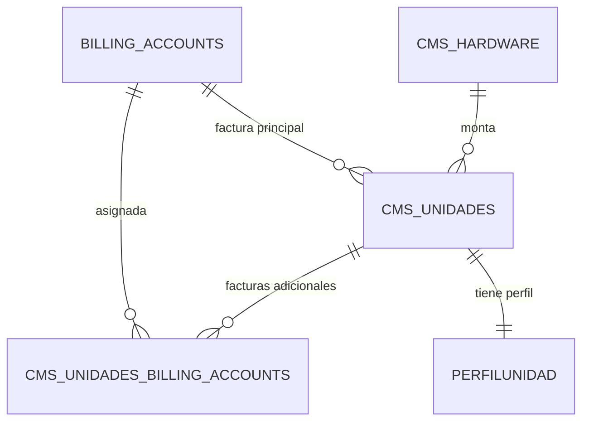

---

## Dominio 7 · Soporte GPS (portal cliente)

<Warning>
  Este dominio usa IDs sin clave foránea formal hacia clientes y usuarios, ya que los datos pueden venir del portal externo del cliente. Las relaciones se muestran como punteadas (lógicas, no enforced en DB).
</Warning>

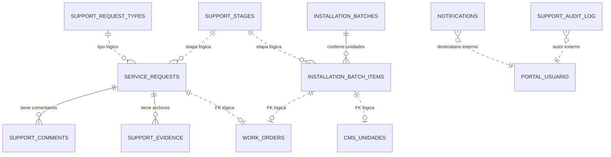

---

## Dominio 8 · Asistencias (checador)

Horario semanal, registros consolidados por empleado/día y bitácora detallada de eventos del dispositivo móvil.

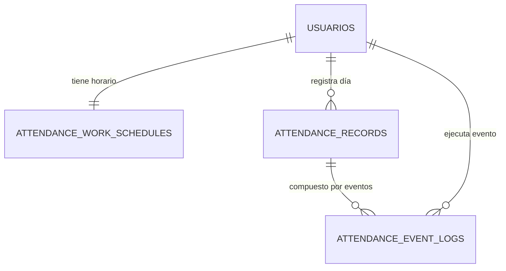

---

## Dominio 9 · Portal Cliente (Soporte GPS)

Tablas exclusivas del backend `soportecliente`: usuarios externos del cliente y su acceso a cuentas B2B. Comparte la mayoría de tablas con el ERP (lee de `iquo_cliente`, `cms_unidades`, `service_requests`, etc.).

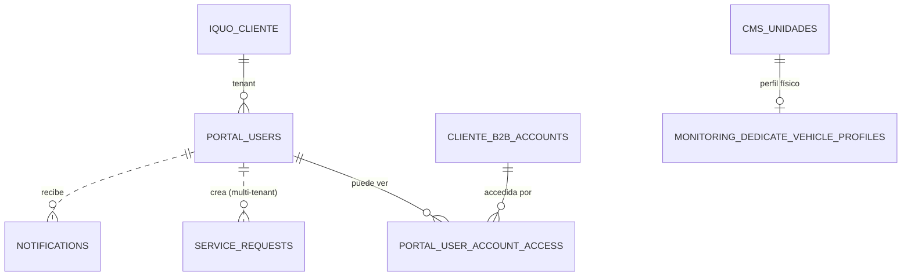

---

## Cómo se usan estos diagramas

- **Para nuevos desarrolladores:** empieza por la vista general de dominios y profundiza en el dominio que vas a tocar.
- **Para diseñar features:** identifica primero qué tablas/dominios toca tu feature y revisa sus relaciones.
- **Para hacer queries:** consulta el diagrama del dominio para entender los JOIN posibles. Los campos exactos están en [Arquitectura de BD](/arquitectura-bd).

<Tip>
  Los diagramas Mermaid son **texto plano** dentro del MDX. Si necesitas actualizar una relación, edita directamente este archivo en el repo. Mintlify re-renderiza automáticamente al hacer push.
</Tip>
